# Azure Arc for Cisco Nexus Switches

## Overview

This solution enables Azure Arc management and monitoring capabilities for Cisco Nexus switches running NX-OS. By onboarding your network infrastructure to Azure Arc, you gain:

### Key Benefits
- **Centralized Management**: Manage network devices alongside other Azure resources in a single pane of glass
- **Real-time Monitoring**: Collect and analyze switch telemetry data using Azure Log Analytics
- **Custom Dashboards**: Create comprehensive monitoring dashboards in Azure Monitor or Grafana
- **Compliance & Governance**: Apply Azure policies and track configuration compliance across your network
- **Hybrid Infrastructure**: Unified visibility across cloud and on-premises network devices
- **Cost Optimization**: Monitor resource utilization and identify optimization opportunities

## Architecture Overview

The solution integrates the following key components:

### Core Components
1. **Azure Arc Agent** - Handles device identity, heartbeat status, and policy delivery to Azure
2. **Azure Arc Services** - Background services (HIMDS, ArcProxy, EXTD, GCAD) managing security, policies, and extensions
3. **Data Parsers** - Extract and transform structured data from Cisco show commands into JSON
4. **Azure Logger** - Sends parsed telemetry directly to Log Analytics REST API using workspace credentials
5. **Collection Orchestrator** - Automated cron-based data collection running every minute

> **Important:** The Azure Logger sends telemetry **directly to Log Analytics** via REST API (ods.opinsights.azure.com). The Arc Agent is responsible for heartbeats and device management, not telemetry transmission.

### Architecture Diagram


### Data Flow Process


## Prerequisites

### Azure Environment Requirements

| Component | Requirement | Purpose |
|-----------|-------------|---------|
| Azure Subscription | Active subscription with Contributor access | Resource provisioning and management |
| Resource Group | Existing or new resource group | Organizing Arc-enabled devices |
| Log Analytics Workspace | Dedicated workspace for switch telemetry | Centralized logging and analytics |
| Network Connectivity | Outbound HTTPS (443) access | Communication with Azure services |

### Cisco Switch Requirements

| Component | Specification | Notes |
|-----------|---------------|-------|
| **Hardware** | Cisco Nexus Switch | Tested on Nexus 9000 series |
| **Operating System** | NX-OS 10.0+ | Must support bash shell access |
| **Access Level** | Root/sudo privileges | Required for service installation |
| **Storage** | Minimum 500MB free space | For Arc agent and tools |
| **Memory** | Minimum 512MB RAM | For Arc services operation |
| **Network** | Internet connectivity | For Azure communication |

### Required Network Connectivity

The switch must have outbound HTTPS access to the following endpoints:


### Pre-Installation Checklist

- [ ] Azure subscription with appropriate permissions
- [ ] Resource group created or selected
- [ ] Log Analytics workspace provisioned
- [ ] Switch has root/bash access
- [ ] Network connectivity verified to required endpoints
- [ ] Switch hostname configured and unique
- [ ] NTP synchronization enabled (recommended)

## Installation Guide

### Installation Process Overview

| # | Step | Description |
|---|------|-------------|
| 1 | **Prepare Azure Resources** | Create Log Analytics workspace and collect Azure credentials |
| 2 | **Collect Azure Information** | Gather subscription ID, tenant ID, workspace ID, and keys |
| 3 | **Configure Installation Script** | Update the setup script with your Azure details |
| 4 | **Access Cisco Switch** | SSH into switch and enter bash shell with root access |
| 5 | **Execute Setup Script** | Run the configured installation script on the switch |
| 6 | **Connect Arc Agent to Azure** | Authenticate and connect the agent to your Azure subscription |
| 7 | **Verify Telemetry Collection** | Validate that data is being collected and sent to Azure |
| 8 | **Setup Dashboards** | Create monitoring dashboards in Azure Monitor or Grafana |
| 9 | **Installation Complete** | System is ready for production monitoring |

### Step 1: Prepare Azure Resources

#### 1.1 Create Log Analytics Workspace

**Method 1: Azure CLI (PowerShell)**
```powershell
# Create resource group (if not exists)
az group create --name "ARCNET" --location "eastus"

# Create Log Analytics workspace
az monitor log-analytics workspace create `
  --resource-group "ARCNET" `
  --workspace-name "CiscoSwitchLogs" `
  --location "eastus"
```

**Method 2: Azure Portal**
1. Navigate to Azure Portal → **Create a resource**
2. Search for **"Log Analytics Workspace"**
3. Configure the workspace:
   - **Subscription**: Your subscription
   - **Resource Group**: `ARCNET` (create new if needed)
   - **Name**: `CiscoSwitchLogs`
   - **Region**: `East US` (or your preferred region)
4. Click **"Review + Create"** → **"Create"**

#### 1.2 Collect Required Azure Information

Gather the following information for script configuration:

**Azure Tenant & Subscription Details:**
```powershell
# Get tenant ID
az account show --query "tenantId" -o tsv

# Get subscription ID  
az account show --query "id" -o tsv
```

**Log Analytics Workspace Credentials:**
```powershell
# Get Workspace ID
az monitor log-analytics workspace show `
  --resource-group "ARCNET" `
  --workspace-name "CiscoSwitchLogs" `
  --query "customerId" -o tsv

# Get Workspace Keys
az monitor log-analytics workspace get-shared-keys `
  --resource-group "ARCNET" `
  --workspace-name "CiscoSwitchLogs" `
  --query "{primary:primarySharedKey, secondary:secondarySharedKey}" -o table
```

**Information Collection Template:**
```powershell
# Save these values for script configuration
$SUBSCRIPTION_ID = "<from az account show>"
$TENANT_ID = "<from az account show>"
$WORKSPACE_ID = "<from workspace show command>"
$PRIMARY_KEY = "<from get-shared-keys command>"
$SECONDARY_KEY = "<from get-shared-keys command>"
$REGION = "eastus"  # or your chosen region
$RESOURCE_GROUP = "ARCNET"
$MACHINE_NAME = "<unique-switch-hostname>"
```
### Step 2: Configure the Installation Script

#### 2.1 Download the Setup Script
1. Download `ArcNet_Cisco_Arc_Setup.sh` from this repository folder
2. Open the script in a text editor

#### 2.2 Update Configuration Variables
Edit the configuration section at the top of the script with your Azure details:

```bash
#============================================
# Azure Configuration - UPDATE THESE VALUES
#============================================
REGION="eastus"                                    # Your Azure region
RESOURCE_GROUP="ARCNET"                           # Your resource group name
SUBSCRIPTION_ID="<YOUR_SUBSCRIPTION_ID>"          # From Step 1.2
MACHINE_NAME="<UNIQUE_SWITCH_HOSTNAME>"           # Unique identifier for this switch
TENANT_ID="<YOUR_TENANT_ID>"                      # From Step 1.2

#===================================================  
# Log Analytics Workspace Configuration - REQUIRED
#===================================================
WORKSPACE_ID="<WORKSPACE_ID_FROM_STEP_1.2>"       # Workspace ID from Step 1.2
PRIMARY_KEY="<PRIMARY_KEY_FROM_STEP_1.2>"         # Primary key from Step 1.2  
SECONDARY_KEY="<SECONDARY_KEY_FROM_STEP_1.2>"     # Secondary key from Step 1.2
```

> **⚠️ Important Notes:**
> - `MACHINE_NAME` must be unique across your organization
> - Use the switch hostname or a descriptive identifier
> - Ensure all keys are within quotes to handle special characters
> - Double-check workspace credentials are correct

### Step 3: Execute Setup on the Cisco Switch

#### 3.1 Access the Switch
Connect to your Cisco Nexus switch via SSH:

```bash
ssh admin@<switch-ip-address>
```

#### 3.2 Enter Bash Shell with Root Access
```bash
# Enter bash shell from NX-OS
switch# run bash

# Become root user (required for installation)
[admin@switch ~]$ sudo su -
[root@switch ~]#
```

#### 3.3 Execute the Setup Script
Copy and paste the entire contents of the configured `ArcNet_Cisco_Arc_Setup.sh` script into the bash shell:

```bash
# The script will execute automatically and show progress
# Expected runtime: 5-10 minutes depending on download speeds
```

**Script Execution Flow:**


**Expected Successful Output:**
```
bash-4.4# bash ArcNet_Cisco_Arc_Setup.sh
[INFO] Validating configuration...
[INFO] Configuration validation passed
[INFO] Checking for existing Arc services...
[INFO] Service 'himdsd' is already running. Will refresh it with this setup.
[INFO] Service 'arcproxyd' is already running. Will refresh it with this setup.
[INFO] Service 'extd' is already running. Will refresh it with this setup.
[INFO] Service 'gcad' is already running. Will refresh it with this setup.
[INFO] Downloading Arc agent RPM...
[INFO] Download attempt 1/3
[INFO] Arc agent RPM downloaded successfully (85M)
[INFO] Installing Arc agent RPM...
Verifying...                          ################################# [100%]
Preparing...                          ################################# [100%]
Verifying...                          ################################# [100%]
Preparing...                          ################################# [100%]
[WARN] Arc agent RPM installation encountered issues, continuing...
[INFO] Configuring GuestConfig services...
[INFO] Configuring DNS servers...
[INFO] DNS_SERVERS not provided, keeping system defaults
[INFO] Setting permissions for Arc binaries...
[INFO] Binary permissions configured
[INFO] Finding writable+executable directory for systemd shims...
[INFO] Using shim directory: /var/bin
[INFO] Configuring system environment (SHIM_DIR=/var/bin)...
[INFO] Environment variables sourced successfully
[INFO] Stopping services...
[INFO] Stopping gcad...
[INFO] Stopping extd...
[INFO] Stopping arcproxyd...
[INFO] Stopping himdsd...
[INFO] Force killing remaining processes...
[INFO] Releasing port 40342...
[INFO] Releasing port 40343...
[INFO] Releasing port 40344...
[INFO] Starting services...
[INFO] Starting himdsd...
[INFO] Starting arcproxyd...
[INFO] Starting extd...
[INFO] Starting gcad...
[INFO] Setup complete. Checking service status...
[INFO] Status of himdsd:
HIMDS is running (PID 15725)
[INFO] Status of arcproxyd:
ArcProxy is running (PID 16194)
[INFO] Status of extd:
EXTD is running (PID 16500)
[INFO] Status of gcad:
GCAD is running (PID 16650)
[INFO] Downloading and installing Cisco parser...
[INFO] Parser installed and verified at /opt/cisco-parser
[INFO] Securing Arc agent binaries...
[INFO] Configuring cron job for telemetry collection...
[WARN] vsh command not found - this script must run on a Cisco switch
[WARN] Cron job setup skipped - vsh is required for parser collector
============================================================================
[SUCCESS] Azure Arc Setup Script Completed Successfully!
============================================================================

Configuration Summary:
  Region: East US
  Resource Group: ARCNET
  Machine Name: NXOSSwitch1a
  Shim Directory: /var/bin
  Parser Path: /opt/cisco-parser
  Workspace ID: ec528795...

NEXT STEPS:
1. Connect the Arc agent to Azure (see README.md for instructions)
2. Verify Arc agent connection with: azcmagent show
3. Check service status with: for svc in himdsd arcproxyd extd gcad; do echo -n "$svc: "; /etc/init.d/$svc status | head -1; done
4. Check cron job: crontab -l | grep cisco-parser-collector
5. View logs in /var/log/arc/
6. Run diagnostic: /opt/arc-diagnostics.sh (once created)

============================================================================
bash-4.4# for svc in himdsd arcproxyd extd gcad; do echo -n "$svc: "; /etc/init.d/$svc status | head -1; done
himdsd: HIMDS is running (PID 15725)
arcproxyd: ArcProxy is running (PID 16194)
extd: EXTD is running (PID 16500)
gcad: GCAD is running (PID 16650)
```

### Step 4: Connect Arc Agent to Azure

After successful script execution, you must connect the Arc agent to your Azure subscription.

#### 4.1 Generate Connection Script from Azure Portal

**Using Azure Portal:**
1. Navigate to **Azure Portal** → **Azure Arc** → **Machines**
2. Click **"+ Add/Create"** → **"Add a machine"**
3. Select **"Add a single server"**
4. Configure connection settings:
   - **Subscription**: Your subscription
   - **Resource Group**: `ARCNET` (or your chosen group)
   - **Region**: `East US` (or your chosen region)
   - **Operating System**: **Linux**
   - **Connectivity Method**: **Public endpoint**
   - **Enable Azure SQL extension deployment**: ❌ **Uncheck this option**
5. Click **"Generate script"**

**Using Azure CLI (Alternative):**
```powershell
# Generate connection command
az connectedmachine connect `
  --resource-group "ARCNET" `
  --name "<MACHINE_NAME>" `
  --location "eastus"
```

#### 4.2 Execute Connection Script on Switch

The Azure Portal will generate a script similar to this structure:

```bash
# Example generated script (your values will be different)
export subscriptionId="<YOUR_SUBSCRIPTION_ID>";
export resourceGroup="ARCNET"; 
export tenantId="<YOUR_TENANT_ID>";
export location="eastus";
export authType="token";
export correlationId="<GENERATED_CORRELATION_ID>";
export cloud="AzureCloud";

# Download and install azcmagent
LINUX_INSTALL_SCRIPT="/tmp/install_linux_azcmagent.sh"
# ... (download and installation logic)

# Connect to Azure Arc
sudo azcmagent connect \
  --resource-group "$resourceGroup" \
  --tenant-id "$tenantId" \
  --location "$location" \
  --subscription-id "$subscriptionId" \
  --cloud "$cloud" \
  --tags 'ArcSQLServerExtensionDeployment=Disabled' \
  --correlation-id "$correlationId";
```

**On the switch (still as root in bash):**
```bash
# Copy the ENTIRE script from Azure Portal and paste it here
# The script will handle authentication automatically
```

#### 4.3 Authentication Process

**Option 1: Device Code Authentication (Most Common)**
```
To sign in, use a web browser to open the page:
https://microsoft.com/devicelogin

And enter the code: ABC123DEF

Waiting for device authentication...
```

**Steps:**
1. Open the provided URL on any device with web browser
2. Enter the displayed code
3. Sign in with your Azure credentials
4. Return to the switch terminal and wait for completion

**Option 2: Service Principal (Automated)**
If you have a service principal configured, the authentication will be automatic.

#### 4.4 Verify Successful Connection

After connection completes, verify the agent status:

```bash
# Check connection status
azcmagent show

# Verify connectivity to Azure
azcmagent check

# List current configuration
azcmagent config list
```

**Expected Output from `azcmagent show`:**
```
Resource Name      : <MACHINE_NAME>
Resource Group     : ARCNET
Tenant ID          : <YOUR_TENANT_ID>
Subscription ID    : <YOUR_SUBSCRIPTION_ID>
Cloud              : AzureCloud
Location           : eastus
Agent Version      : 1.x.x
Agent Status       : Connected
Last Heartbeat     : <timestamp>
Machine ID         : <unique-machine-id>
```

**Connection Status Indicators:**
- ✅ **Agent Status: Connected** - Successfully connected to Azure
- ❌ **Agent Status: Disconnected** - Connection failed, check troubleshooting
- ⚠️ **Agent Status: Expired** - Authentication needs renewal

**Troubleshooting Connection Issues:**

| Issue | Symptoms | Solution |
|-------|----------|----------|
| **Network Connectivity** | Connection timeouts | Verify outbound HTTPS (443) access to `*.his.arc.azure.com` |
| **Authentication Failed** | Device code errors | Ensure user has appropriate permissions in Azure subscription |
| **Service Not Running** | "Cannot connect to agent" | Restart HIMDS: `/etc/init.d/himdsd restart` |
| **DNS Resolution** | "Cannot resolve hostname" | Verify DNS settings and connectivity |

```mermaid
graph TD
    A[Execute Connection Script] --> B{Authentication Method}
    B -->|Device Code| C[Open Browser]
    B -->|Service Principal| D[Automatic Auth]
    C --> E[Enter Code & Sign In]
    D --> F[Verify Connection]
    E --> F
    F --> G{Agent Status}
    G -->|Connected| H[✅ Success - Proceed to Step 5]
    G -->|Failed| I[❌ Troubleshoot Connection]
    I --> J[Check Network/DNS/Services]
    J --> K[Retry Connection]
    K --> F
    
    style H fill:#e8f5e8,stroke:#2e7d32,stroke-width:2px
    style I fill:#ffebee,stroke:#c62828,stroke-width:2px
    style A fill:#e1f5fe,stroke:#01579b,stroke-width:2px
```



### Step 5: Verify Telemetry Collection

#### 5.1 Validate Collection Services

After successful Arc connection, verify that telemetry collection is working:

```bash
# Check if cron job is properly configured
crontab -l | grep cisco-parser-collector
# Expected: */1 * * * * /opt/cisco-parser-collector.sh >> /var/log/cisco-parser-collector.log 2>&1

# Check collector script exists and is executable
ls -la /opt/cisco-parser-collector.sh
stat /opt/cisco-parser

# Manually execute one collection cycle
/opt/cisco-parser-collector.sh

# Monitor collection logs in real-time
tail -f /var/log/cisco-parser-collector.log
```

#### 5.2 Test Manual Data Collection

Validate the complete telemetry pipeline with a single command:

```bash
# Step 1: Execute a sample show command
vsh -c "show class-map" > /tmp/test-classmap-output.txt

# Step 2: Parse the output to JSON
/opt/cisco-parser -p class-map -i /tmp/test-classmap-output.txt -o /tmp/test-classmap-parsed.json

# Step 3: Verify parsed JSON structure
cat /tmp/test-classmap-parsed.json | head -20

# Step 4: Send to Azure Log Analytics
/opt/cisco-azure-logger-v2.sh send CiscoClassMapTest /tmp/test-classmap-parsed.json

# Step 5: Clean up test files  
rm /tmp/test-classmap-output.txt /tmp/test-classmap-parsed.json
```

**Expected JSON Structure:**
```json
{
  "hostname": "switch-name",
  "timestamp": "2025-12-09T10:30:00Z",
  "command": "show class-map",
  "data": [
    {
      "class_map_name": "class-default",
      "match_criteria": "any",
      "policy_applied": "none"
    }
  ]
}
```

#### 5.3 Verify Data in Azure Log Analytics

**Wait Time:** Allow 5-15 minutes for data ingestion into Azure.

**Access Log Analytics:**
1. Navigate to **Azure Portal** → **Log Analytics workspaces** → **CiscoSwitchLogs**
2. Click **"Logs"** in the left navigation menu
3. Execute the following validation queries:

**Query 1: Check for Custom Tables**
```kusto
// Discover all custom tables created by the solution
search "*" 
| where TimeGenerated > ago(1h)
| where Type endswith "_CL"
| distinct Type
| sort by Type
```

**Query 2: Verify Recent Data**
```kusto  
// Check for recent data from your switch
union Cisco*_CL
| where TimeGenerated > ago(30m)
| summarize 
    RecordCount = count(),
    LatestRecord = max(TimeGenerated),
    TablesWithData = make_set(Type)
| project RecordCount, LatestRecord, TablesWithData
```

**Query 3: Switch-Specific Data**
```kusto
// View data from specific switch (replace with your switch hostname)
union Cisco*_CL
| where hostname_s == "<YOUR_SWITCH_HOSTNAME>"
| where TimeGenerated > ago(1h)
| summarize count() by Type, bin(TimeGenerated, 5m)
| render timechart
```

#### 5.4 Collection Health Monitoring

Create ongoing monitoring for the telemetry collection system:

**Daily Health Check Script:**
```bash
#!/bin/bash
echo "=== Cisco Arc Telemetry Health Check ==="
echo "Date: $(date)"
echo ""

echo "Arc Agent Status:"
azcmagent show | grep -E "Agent Status|Last Heartbeat"
echo ""

echo "Service Status:"
for svc in himdsd arcproxyd extd gcad; do
    echo "  $svc: $(/etc/init.d/$svc status | grep -o 'running\|stopped')"
done
echo ""

echo "Collection Status:"
echo "  Cron job: $(crontab -l | grep cisco-parser-collector | wc -l) configured"
echo "  Last collection: $(tail -1 /var/log/cisco-parser-collector.log | awk '{print $1, $2}')"
echo "  Parser binary: $(test -x /opt/cisco-parser && echo 'OK' || echo 'MISSING')"
echo "  Logger script: $(test -x /opt/cisco-azure-logger-v2.sh && echo 'OK' || echo 'MISSING')"
echo ""

echo "Recent Log Entries:"
tail -5 /var/log/cisco-parser-collector.log
```

**Save this script as `/opt/health-check.sh` and make it executable:**
```bash
chmod +x /opt/health-check.sh
```

## Monitored Telemetry Tables

The solution creates comprehensive telemetry tables in your Log Analytics workspace


### Telemetry Table Reference

| Table Name | Description | Key Metrics | Update Frequency |
|------------|-------------|-------------|------------------|
| **Device Health** |
| `CiscoInventory_CL` | Hardware inventory (chassis, modules, transceivers) | Serial numbers, part numbers, versions | Every minute |
| `CiscoSystemResources_CL` | System resource utilization | CPU %, Memory %, Load average | Every minute |
| `CiscoSystemUptime_CL` | System availability and uptime | Boot time, uptime duration | Every minute |
| `CiscoEnvTemp_CL` | Environmental temperature monitoring | Sensor readings, thresholds, status | Every minute |
| `CiscoEnvPower_CL` | Power supply and fan status | PSU status, fan speeds, power draw | Every minute |
| **Network Performance** |
| `CiscoInterfaceCounter_CL` | Interface traffic statistics | Bytes/packets in/out, utilization % | Every minute |
| `CiscoInterfaceErrors_CL` | Interface error counters | CRC errors, drops, collisions | Every minute |
| `CiscoTransceiver_CL` | Optical transceiver details | Signal levels, wavelengths, vendor info | Every minute |
| `CiscoClassMap_CL` | QoS class map configuration | Traffic classes, match criteria | Every minute |
| **Network Topology** |
| `CiscoLldpNeighbor_CL` | LLDP neighbor discovery | Connected devices, capabilities | Every minute |
| `CiscoMacAddress_CL` | MAC address table entries | MAC addresses, VLANs, ports | Every minute |
| `CiscoIpArp_CL` | ARP table entries | IP to MAC mappings, interfaces | Every minute |
| **Routing & BGP** |
| `CiscoIpRoute_CL` | IP routing table | Networks, next hops, metrics | Every minute |
| `CiscoBgpSummary_CL` | BGP neighbor status | Peer states, route counts, uptime | Every minute |

> **📝 Note:** Azure automatically appends `_CL` suffix to all custom log table names.

## Service Management & Operations

### Service Architecture Overview


### Service Status Management

#### Check All Services Status
```bash
# Comprehensive service status check
echo "=== Azure Arc Service Status ==="
for svc in himdsd arcproxyd extd gcad; do
    echo -n "$svc: "
    /etc/init.d/$svc status | grep -o 'running\|stopped\|dead' || echo "unknown"
done

# Check service processes
echo -e "\n=== Running Processes ==="
ps aux | grep -E 'himds|arcproxy|extd|gcad' | grep -v grep

# Check service ports
echo -e "\n=== Service Ports ==="
netstat -tulpn | grep -E '40342|40343|40344'

# Check telemetry collection
echo -e "\n=== Telemetry Collection ==="
echo "Cron job: $(crontab -l | grep cisco-parser-collector | wc -l) configured"
echo "Last collection: $(tail -1 /var/log/cisco-parser-collector.log 2>/dev/null | awk '{print $1, $2}' || echo 'No logs found')"
```

#### Individual Service Management
```bash
# Start a specific service
/etc/init.d/himdsd start

# Stop a specific service  
/etc/init.d/himdsd stop

# Restart a specific service
/etc/init.d/himdsd restart

# Check detailed service status
/etc/init.d/himdsd status
```

#### Restart All Services (Proper Order)
```bash
# Stop services in reverse dependency order
echo "Stopping services in correct order..."
for svc in gcad extd arcproxyd himdsd; do
    echo "Stopping $svc..."
    /etc/init.d/$svc stop
    sleep 2
done

# Start services in dependency order
echo "Starting services in correct order..."
for svc in himdsd arcproxyd extd gcad; do
    echo "Starting $svc..."
    /etc/init.d/$svc start
    sleep 5
    
    # Verify service started successfully
    if /etc/init.d/$svc status | grep -q "running"; then
        echo "  ✓ $svc started successfully"
    else
        echo "  ❌ $svc failed to start"
    fi
done
```

### Log File Monitoring

#### Service Logs Location and Purpose
| Service | Log File | Purpose |
|---------|----------|---------|
| **HIMDS** | `/var/opt/azcmagent/log/himds.log` | Metadata service operations, heartbeats |
| **ArcProxy** | `/var/opt/azcmagent/log/arcproxy.log` | Extension management, download operations |
| **Extension Service** | `/var/log/azure/` | Extension-specific logs |
| **Guest Config** | `/var/lib/GuestConfig/gc_agent_logs/gc_agent.log` | Configuration compliance, policies |
| **Telemetry Collector** | `/var/log/cisco-parser-collector.log` | Data collection and parsing operations |

#### Real-time Log Monitoring
```bash
# Monitor all critical logs simultaneously
tail -f \
  /var/opt/azcmagent/log/himds.log \
  /var/opt/azcmagent/log/arcproxy.log \
  /var/lib/GuestConfig/gc_agent_logs/gc_agent.log \
  /var/log/cisco-parser-collector.log

# Monitor specific service logs
tail -f /var/opt/azcmagent/log/himds.log       # HIMDS operations
tail -f /var/opt/azcmagent/log/arcproxy.log    # Extension management
tail -f /var/log/cisco-parser-collector.log   # Telemetry collection
```

#### Log Analysis Commands
```bash
# Check for recent errors in HIMDS
grep -i error /var/opt/azcmagent/log/himds.log | tail -10

# Check Arc agent heartbeat status  
grep -i heartbeat /var/opt/azcmagent/log/himds.log | tail -5

# Monitor telemetry collection success/failures
grep -E "SUCCESS|FAILED|ERROR" /var/log/cisco-parser-collector.log | tail -10

# Check for network connectivity issues
grep -i "connection\|timeout\|refused" /var/opt/azcmagent/log/*.log | tail -10
```

## Troubleshooting Guide

### Common Issues & Solutions

#### Issue 1: Arc Agent Shows "Disconnected" Status

**Symptoms:**
```bash
azcmagent show
# Output: Agent Status: Disconnected
```

**Diagnosis & Solutions:**
```bash
# Step 1: Check HIMDS service
/etc/init.d/himdsd status
# If stopped, restart: /etc/init.d/himdsd start

# Step 2: Test connectivity to Azure
curl -I https://gbl.his.arc.azure.com
curl -I https://login.microsoftonline.com

# Step 3: Check for port conflicts
netstat -tulpn | grep 40342
# Should show himds process listening

# Step 4: Review connection logs
grep -i "connection" /var/opt/azcmagent/log/himds.log | tail -10

# Step 5: Reconnect if needed
azcmagent disconnect
# Then re-run Azure connection script from Step 4
```

#### Issue 2: Services Keep Stopping Automatically

**Symptoms:**
- Services show as stopped when checked
- Processes not visible in `ps aux`
- Port conflicts in logs

**Solutions:**
```bash
# Step 1: Check for port conflicts
netstat -tulpn | grep -E '40342|40343|40344'

# Step 2: Kill conflicting processes
fuser -k 40342/tcp 40343/tcp 40344/tcp

# Step 3: Check system resources
free -m    # Check available memory
df -h      # Check disk space

# Step 4: Review system logs
dmesg | grep -i "killed\|oom" | tail -5

# Step 5: Restart services with resource monitoring
for svc in himdsd arcproxyd extd gcad; do
    /etc/init.d/$svc restart
    sleep 5
    echo "$svc memory usage: $(ps aux | grep $svc | grep -v grep | awk '{print $6}') KB"
done
```

#### Issue 3: No Telemetry Data in Azure Log Analytics

**Symptoms:**
- Kusto queries return no results after 15+ minutes
- Collection logs show errors
- Parser or logger failures

**Diagnosis Workflow:**


**Diagnostic Commands:**
```bash
# Step 1: Test complete pipeline manually
echo "Testing telemetry pipeline..."
vsh -c "show version" > /tmp/test-version.txt
/opt/cisco-parser -p version -i /tmp/test-version.txt -o /tmp/test-version.json

# Step 2: Verify JSON output
if [ -s /tmp/test-version.json ]; then
    echo "✓ Parsing successful"
    cat /tmp/test-version.json | head -10
else
    echo "❌ Parsing failed"
    exit 1
fi

# Step 3: Test Azure logger
/opt/cisco-azure-logger-v2.sh test
/opt/cisco-azure-logger-v2.sh send CiscoVersionTest /tmp/test-version.json

# Step 4: Check workspace credentials
grep -E "WORKSPACE_ID|PRIMARY_KEY" /opt/cisco-azure-logger-v2.sh | head -2

# Step 5: Clean up
rm /tmp/test-version.txt /tmp/test-version.json
```

#### Issue 4: Authentication/Permission Errors

**Symptoms:**
- HTTP 401/403 errors in logs
- "Authentication failed" messages
- Azure connection timeouts

**Solutions:**
```bash
# Step 1: Verify Arc agent authentication
azcmagent check

# Step 2: Check Azure AD permissions
# Ensure the user/service principal has:
# - "Azure Connected Machine Onboarding" role
# - "Log Analytics Contributor" role on workspace

# Step 3: Regenerate connection if needed
azcmagent disconnect
# Re-run connection script from Azure Portal

# Step 4: Test specific endpoint connectivity
curl -v https://${WORKSPACE_ID}.ods.opinsights.azure.com
```

### Diagnostic Automation Script

Create a comprehensive diagnostic script:

```bash
#!/bin/bash
# Save as /opt/arc-diagnostics.sh

echo "============================================="
echo "Azure Arc for Cisco - Diagnostic Report"
echo "Date: $(date)"
echo "Hostname: $(hostname)"
echo "============================================="

echo -e "\n=== SYSTEM INFO ==="
uname -a
free -m | grep Mem
df -h / | tail -1

echo -e "\n=== ARC AGENT STATUS ==="
if command -v azcmagent &> /dev/null; then
    azcmagent show 2>&1 | grep -E "Status|Version|Resource"
    echo ""
    azcmagent check 2>&1 | head -10
else
    echo "❌ azcmagent not installed"
fi

echo -e "\n=== SERVICE STATUS ==="
for svc in himdsd arcproxyd extd gcad; do
    status=$(/etc/init.d/$svc status 2>&1 | grep -o 'running\|stopped\|dead' || echo "unknown")
    pid=$(ps aux | grep $svc | grep -v grep | awk '{print $2}' | head -1)
    echo "$svc: $status (PID: ${pid:-none})"
done

echo -e "\n=== PORT STATUS ==="
for port in 40342 40343 40344; do
    listener=$(netstat -tuln | grep ":$port " | awk '{print $1}')
    echo "Port $port: ${listener:-not listening}"
done

echo -e "\n=== TELEMETRY STATUS ==="
if crontab -l 2>/dev/null | grep -q cisco-parser-collector; then
    echo "✓ Cron job configured"
else
    echo "❌ Cron job missing"
fi

if [ -x /opt/cisco-parser ]; then
    echo "✓ Parser binary present"
else
    echo "❌ Parser binary missing"
fi

if [ -x /opt/cisco-azure-logger-v2.sh ]; then
    echo "✓ Logger script present"
else
    echo "❌ Logger script missing"
fi

echo -e "\n=== RECENT LOGS ==="
echo "--- HIMDS ---"
tail -3 /var/opt/azcmagent/log/himds.log 2>/dev/null || echo "No HIMDS logs"

echo "--- Telemetry Collector ---"
tail -3 /var/log/cisco-parser-collector.log 2>/dev/null || echo "No collector logs"

echo -e "\n=== CONNECTIVITY TEST ==="
for endpoint in "gbl.his.arc.azure.com" "login.microsoftonline.com"; do
    if curl -s --max-time 5 -I "https://$endpoint" >/dev/null; then
        echo "✓ $endpoint reachable"
    else
        echo "❌ $endpoint unreachable"
    fi
done

echo -e "\n============================================="
echo "Diagnostic Report Complete"
echo "============================================="
```

Make the diagnostic script executable:
```bash
chmod +x /opt/arc-diagnostics.sh
```

### Emergency Recovery Procedures

#### Complete Service Reset
```bash
#!/bin/bash
# Emergency recovery script

echo "Starting emergency recovery..."

# Stop all services
for svc in gcad extd arcproxyd himdsd; do
    /etc/init.d/$svc stop 2>/dev/null
    sleep 2
done

# Kill any remaining processes
killall himds arcproxy extd gcad 2>/dev/null

# Clear any stuck ports
for port in 40342 40343 40344; do
    fuser -k ${port}/tcp 2>/dev/null
done

# Wait for cleanup
sleep 10

# Restart in correct order
for svc in himdsd arcproxyd extd gcad; do
    echo "Starting $svc..."
    /etc/init.d/$svc start
    sleep 5
    
    if /etc/init.d/$svc status | grep -q running; then
        echo "✓ $svc started"
    else
        echo "❌ $svc failed to start"
    fi
done

echo "Recovery complete. Run /opt/arc-diagnostics.sh to verify."
```

## Cleanup & Decommissioning

### Complete Removal Process

When decommissioning or removing Azure Arc from a switch:

#### Step 1: Disconnect from Azure Arc
```bash
# Disconnect the agent from Azure
azcmagent disconnect

# Verify disconnection
azcmagent show
# Should show: "The machine is not connected to Azure"
```

#### Step 2: Stop and Remove Services
```bash
# Stop all Arc services
for svc in gcad extd arcproxyd himdsd; do
    echo "Stopping $svc..."
    /etc/init.d/$svc stop
done

# Remove service scripts
rm -f /etc/init.d/himdsd
rm -f /etc/init.d/arcproxyd  
rm -f /etc/init.d/extd
rm -f /etc/init.d/gcad

# Kill any remaining processes
killall himds arcproxy extd gcad 2>/dev/null
```

#### Step 3: Remove Telemetry Collection
```bash
# Remove cron job
crontab -l | grep -v cisco-parser-collector | crontab -

# Remove telemetry scripts and binaries
rm -f /opt/cisco-parser
rm -f /opt/cisco-azure-logger-v2.sh
rm -f /opt/cisco-parser-collector.sh
rm -f /opt/arc-diagnostics.sh

# Remove log files
rm -f /var/log/cisco-parser-collector.log
```

#### Step 4: Remove Arc Agent
```bash
# Uninstall Arc agent package
if rpm -q azcmagent; then
    rpm -e azcmagent
fi

# Remove Arc agent files and directories
rm -rf /var/opt/azcmagent/
rm -rf /var/lib/GuestConfig/
rm -rf /etc/opt/azcmagent/
rm -rf /var/log/azure/
```

#### Step 5: Clean Up Azure Resources
```powershell
# From Azure CLI or Portal, remove the Arc-enabled server resource
az connectedmachine delete `
    --resource-group "ARCNET" `
    --name "<MACHINE_NAME>" `
    --yes

# Optionally, remove the Log Analytics workspace if no longer needed
az monitor log-analytics workspace delete `
    --resource-group "ARCNET" `
    --workspace-name "CiscoSwitchLogs" `
    --yes
```

### Verification of Complete Removal
```bash
# Verify no Arc processes running
ps aux | grep -E 'himds|arcproxy|extd|gcad' | grep -v grep

# Verify no Arc ports listening
netstat -tuln | grep -E '40342|40343|40344'

# Verify no cron jobs
crontab -l | grep cisco

# Verify no Arc files remain
find /opt /var -name "*arc*" -o -name "*cisco*" 2>/dev/null | grep -E "(cisco-|arc)" | head -10
```

## Grafana Dashboard Integration

### Architecture for Grafana Integration


### Prerequisites for Grafana Integration

| Component | Requirement | Purpose |
|-----------|-------------|---------|
| **Grafana Version** | 8.0+ with Azure Monitor plugin | Data source connectivity |
| **Azure Authentication** | Service Principal or Managed Identity | Secure API access |
| **Permissions** | Log Analytics Reader role | Query workspace data |
| **Network Access** | HTTPS to Azure endpoints | API connectivity |
