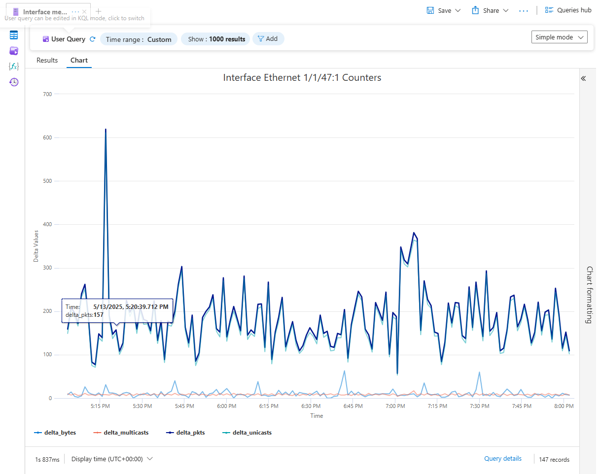
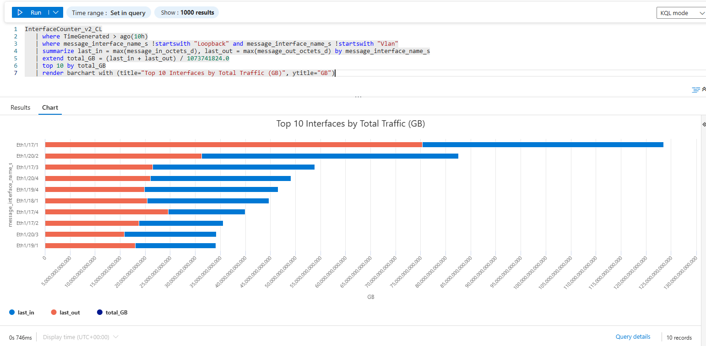
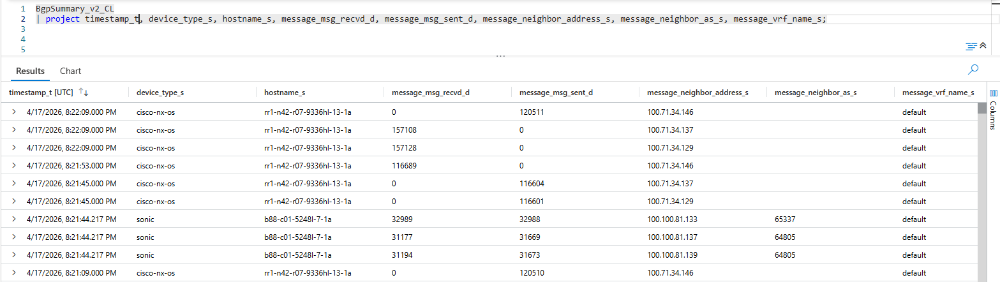
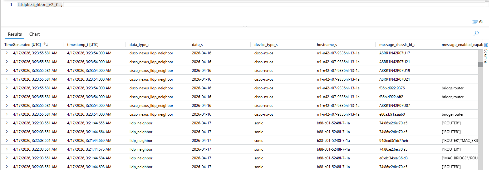
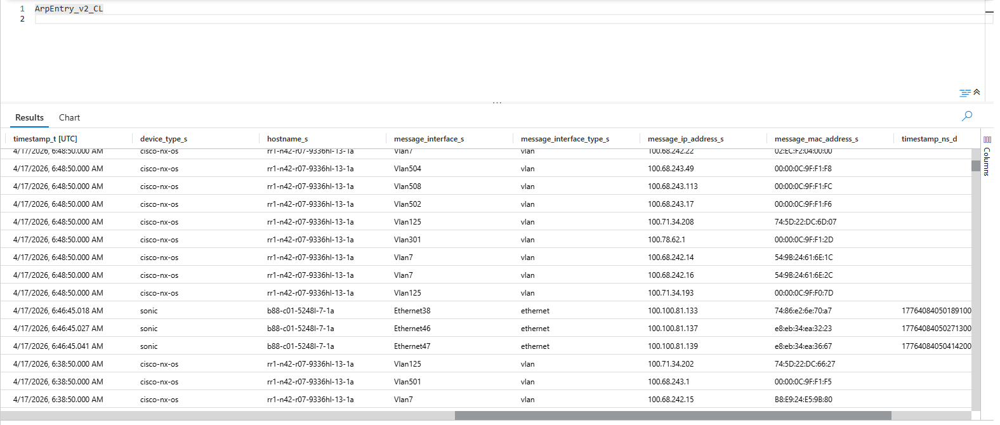
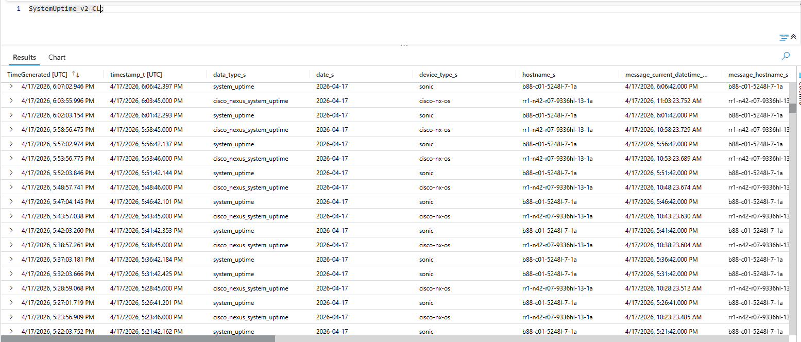
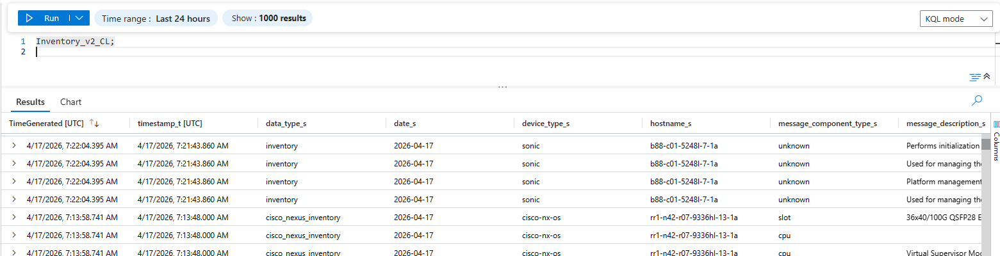

# gNMI Collector — Telemetry Tables Reference

The gnmi-collector ships structured telemetry from network switches to
Azure Log Analytics. Each telemetry category is stored in its own custom
log table. Both **Cisco NX-OS** and **SONiC** data lands in the same set
of tables, distinguished by the `device_type` column.

> **Note**: Field names and schemas may evolve between releases. This
> document covers the table categories and their purpose — not individual
> fields. Refer to the config files (`config.cisco.yaml`,
> `config.sonic.yaml`) for the exact YANG paths collected per platform.

---

## Table Overview

| # | Table Name | Category | Cisco | SONiC | Description |
|---|-----------|----------|:-----:|:-----:|-------------|
| 1 | `InterfaceCounter_v2_CL` | Interfaces | ✅ | ✅ | Per-interface traffic counters (bytes, packets, unicast, multicast, broadcast, errors, discards) |
| 2 | `InterfaceStatus_v2_CL` | Interfaces | ✅ | ✅ | Interface operational and admin state (up/down, speed, MTU, description) |
| 3 | `InterfaceEthernet_v2_CL` | Interfaces | ✅ | ✅ | Ethernet-specific state (speed, duplex, auto-negotiate, CRC/fragment/jabber counters) |
| 4 | `InterfaceErrors_v2_CL` | Interfaces | ✅ | — | Detailed L1/L2 error counters (CRC, collisions, runts, jabbers, overruns) via Cisco-native YANG |
| 5 | `SystemUptime_v2_CL` | System | ✅ | ✅ | System hostname, boot time, uptime, and current date/time |
| 6 | `SystemResources_v2_CL` | System | ✅ | ✅ | CPU utilization (per-core), memory usage, and load averages |
| 7 | `Inventory_v2_CL` | Platform | ✅ | ✅ | Hardware inventory — chassis, line cards, fans, PSUs, CPUs, transceivers with serial numbers and descriptions |
| 8 | `BgpSummary_v2_CL` | Routing | ✅ | ✅ | Per-neighbor BGP session state, AS numbers, message counts, prefix counts, and uptime |
| 9 | `BgpGlobal_v2_CL` | Routing | ✅ | ✅ | BGP global state — router ID, local AS, total paths and prefixes |
| 10 | `RouteSummary_v2_CL` | Routing | ✅ | — | IPv4 route summary per VRF — total routes, paths, and multipath counts (Cisco-native YANG) |
| 11 | `LldpNeighbor_v2_CL` | Discovery | ✅ | ✅ | LLDP neighbor table — local port, remote system name, remote port, chassis ID, capabilities |
| 12 | `ArpEntry_v2_CL` | Discovery | ✅ | ✅ | ARP/neighbor table — IP address, MAC address, interface, entry type |
| 13 | `MacTable_v2_CL` | Discovery | ✅ | ✅ | MAC address table — MAC, VLAN, port, type (static/dynamic) |
| 14 | `EnvTemp_v2_CL` | Environment | ✅ | — | Temperature sensor readings with thresholds and alert status (Cisco-native YANG) |
| 15 | `EnvPower_v2_CL` | Environment | ✅ | — | Power supply status, voltage, current, and wattage per PSU (Cisco-native YANG) |
| 16 | `Transceiver_v2_CL` | Optics | ✅ | ✅ | Transceiver presence, type, manufacturer, part/serial numbers |
| 17 | `TransceiverDom_v2_CL` | Optics | ✅ | ✅ | Transceiver DOM — optical Tx/Rx power, laser bias current per channel |
| 18 | `Version_v2_CL` | System | ✅ | — | NX-OS version, system image, system name, serial number (Cisco-native YANG) |
| 19 | `DeviceMetadata_v2_CL` | System | — | ✅ | SONiC device metadata — hostname, hardware SKU, platform, MAC address |

---

## Platform Coverage

```
                      Cisco NX-OS     SONiC
Interfaces                ████████████████████
System / Resources        ████████████████████
Platform Inventory        ████████████████████
BGP Routing               ████████████████████
LLDP / ARP / MAC          ████████████████████
Environment (Temp/PSU)    ██████████
Optics (Transceiver/DOM)  ████████████████████
Route Summary             ██████████
Version / Metadata        ████████████████████
```

Cisco NX-OS has full coverage across all 18 table categories. SONiC covers
13 of 18 — the gaps are Cisco-native YANG paths (interface errors, route
summary, environment sensors) that have no OpenConfig equivalent on SONiC.

---

## Sample Screenshots

The following screenshots were taken from Azure Log Analytics and show
real telemetry collected from both Cisco NX-OS and SONiC switches.

### Interface Counters — Traffic Chart

Per-interface traffic counters (bytes, packets, unicast, multicast) plotted
over time. Useful for spotting traffic spikes and link utilization patterns.



### Interface Counters — Top Interfaces by Traffic

Bar chart showing the top 10 busiest interfaces ranked by total bytes
(in + out). Quickly identifies which links carry the most traffic.



### BGP Peers

BGP neighbor table showing session state, message counts, and prefix
counts for all peers. Both Cisco and SONiC peers appear in the same table
with the `device_type` column distinguishing them.



### LLDP Neighbors

LLDP neighbor discovery table showing local port, remote device name,
remote port, chassis ID, and device capabilities. Provides a live view
of the physical network topology.



### ARP Table

ARP entries across all VLANs and interfaces, showing IP-to-MAC mappings.
Both Cisco (VLAN interfaces) and SONiC (Ethernet interfaces) entries are
visible.



### System Uptime

System uptime records for all monitored switches. Alternating entries from
Cisco NX-OS and SONiC show both platforms reporting on the same polling
cadence.



### Platform Inventory

Hardware inventory showing chassis components — line cards, CPUs, fans,
PSUs, and transceivers. Component type and description are included for
each entry.



---

## Collection Modes

All paths support **poll mode** (periodic gNMI `Get`). Most paths also
support **subscribe mode** (persistent gNMI `Subscribe` stream) with
per-path `sample` or `on_change` options.

| Default Interval | Tables |
|-----------------|--------|
| **60 seconds** | Interface Counters, Interface Status, Interface Ethernet, Transceiver DOM |
| **300 seconds** | All other tables (BGP, system, inventory, ARP, MAC, LLDP, environment) |

### on_change Support

- **Cisco NX-OS**: All paths support `on_change` subscribe mode.
- **SONiC**: Most paths support `on_change`, except those backed by
  COUNTERS DB (interface counters, interface status) which require
  `sample` mode. See `config.sonic.yaml` for per-path notes.

---

## Querying Tables in Azure

All tables are accessible via KQL in the Azure Log Analytics workspace.
Common columns across all tables:

- `TimeGenerated` — Azure ingestion timestamp
- `timestamp_t` — Switch-side collection timestamp
- `device_type_s` — Platform identifier (`cisco-nx-os` or `sonic`)
- `hostname_s` — Switch hostname
- `data_type_s` — Transformer name that produced the row

### Example Query

```kql
// Show latest BGP peer state across all switches
BgpSummary_v2_CL
| where TimeGenerated > ago(1h)
| summarize arg_max(TimeGenerated, *) by device_type_s, hostname_s, message_neighbor_address_s
| project TimeGenerated, device_type_s, hostname_s, message_neighbor_address_s, message_neighbor_as_s, message_msg_recvd_d, message_msg_sent_d
```
