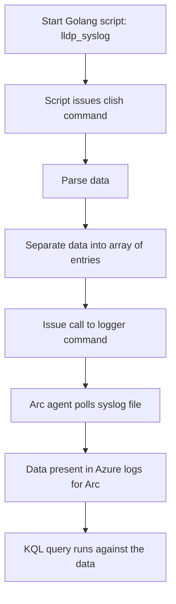

# Switch LLDP



## Example Data

[show lldp neighbor details](./show-lldp-neighbors-detail.txt)


## KQL

[KQL file](./lldp-kql-query.kql)

```sql
Syslog 
| where ProcessName contains "LLDPNeighbor"
| where EventTime between ( datetime(2025-5-13 17:09:39) .. datetime(2025-5-13 17:09:40) )
| extend syslogItems = parse_json(SyslogMessage)
| project 
    EventTime = EventTime,
    Switch = Computer,
    S_Port = tostring(syslogItems.local_port_id),
    D_Device = tostring(syslogItems.remote_system_name),
    D_Port = tostring(syslogItems.remote_port_id),
    D_Desc = tostring(syslogItems.remote_port_description),
    D_MTU = tostring(syslogItems.remote_mtu)
```

## Example lldp neighbor details

[LLDP Example Data](./show-lldp-neighbors-detail.txt)

## Example LLDP JSON

```JSON
{
    "hostname": "",
    "local_port_id": "ethernet1/1/52",
    "remote_system_name": "s46r23b-Rack01-TOR-2",
    "remote_port_id": "ethernet1/1/52",
    "remote_chassis_id": "0c:29:ef:c3:0b:20",
    "remote_port_description": "ethernet1/1/52",
    "remote_mtu": "9216",
    "timestamp": "2025-05-13T17:09:39.0000000Z"
}
```
