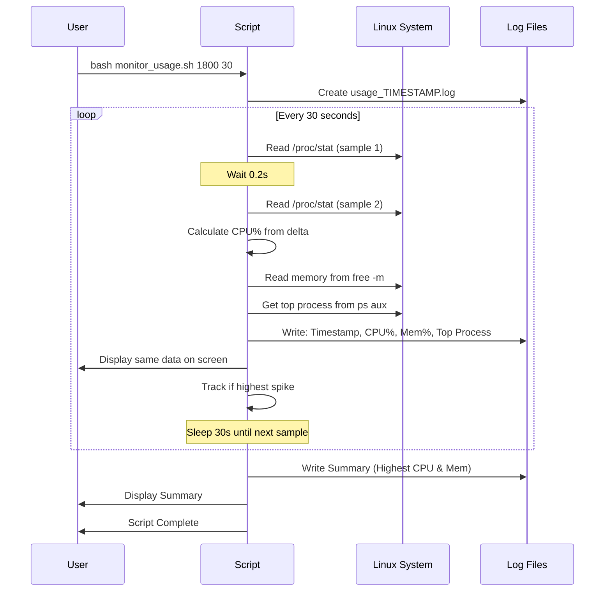

# System Usage Monitor

Monitor Linux system CPU and memory usage, track spikes, and identify top resource-consuming processes.

## How It Works



## Quick Start

### Run & Control
```bash
# Run in background for 30 mins, sample every 30s
nohup bash monitor_usage.sh 1800 30 &

# Check if running
pgrep -af monitor_usage

# Stop the script
kill $(pgrep -f monitor_usage.sh)

# View results in real-time
tail -f monitor.log
```

### Output Example
```
Timestamp, CPU_Used(%), Mem_Used(%), Mem_Detail(used/total MB), Top_Process(CPU%)
2025-11-18 13:10:05, 53.80, 49.81, 11935MB/23963MB, /isan/bin/vsh.bin(89.4%)
```

### Summary Report
```
Highest CPU Used : 53.80% at 2025-11-18 13:10:05
  Top Process   : /isan/bin/vsh.bin(89.4%)
Highest Mem Used : 49.98% at 2025-11-18 13:35:19 (11976MB/23963MB)
  Top Process   : /isan/bin/nxpython3(19.8%)
```

## Understanding the Metrics

| Metric | What It Means | Why Different from Process? |
|--------|---------------|------------------------------|
| **CPU_Used(%)** | System-wide CPU usage averaged over 0.2s | Measured across ALL cores |
| **Top Process CPU** | Single process CPU usage at that instant | Can exceed 100% on multi-core (200% = 2 cores) |
| **Mem_Used(%)** | Current system memory usage | System total vs process individual |

**Example:** CPU 53% but process shows 89%?
- System: 53% average across 8 cores (total capacity)
- Process: 89% of 1 core = ~11% of total system capacity

## Common Commands

```bash
# Default: 1 hour, sample every 60s
bash monitor_usage.sh

# Custom: 2 hours, sample every 30s
bash monitor_usage.sh 7200 30

# Quick test: 5 minutes, sample every 10s
bash monitor_usage.sh 300 10
```

## Troubleshooting

| Issue | Solution |
|-------|----------|
| Permission denied | Use `bash monitor_usage.sh` instead of `./monitor_usage.sh` |
| Script not running | Check with `pgrep -af monitor_usage` |
| High CPU from `ps` | Normal - measurement overhead, doesn't affect system CPU% reading |
