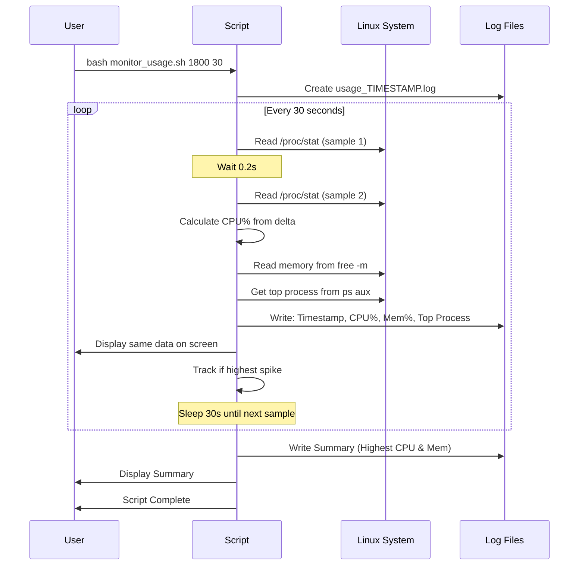
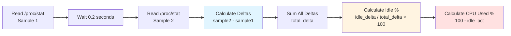

# System Usage Monitor

Monitor Linux system CPU and memory usage, track spikes, and identify top resource-consuming processes.

## How It Works



## Quick Start

### Run & Control
```bash
# Run in background for 30 mins, sample every 30s
nohup bash monitor_usage.sh 1800 30 > monitor.log 2>&1 &

# Check if running
pgrep -af monitor_usage

# Stop the script
kill $(pgrep -f monitor_usage.sh)

# View results in real-time
tail -f monitor.log
```

### Output Example
```
Timestamp, CPU_Used(%), Mem_Used(%), Mem_Detail(used/total MB), Top_Process(CPU%)
2025-11-18 13:10:05, 53.80, 49.81, 11935MB/23963MB, /isan/bin/vsh.bin(89.4%)
```

### Summary Report
```
Highest CPU Used : 53.80% at 2025-11-18 13:10:05
  Top Process   : /isan/bin/vsh.bin(89.4%)
Highest Mem Used : 49.98% at 2025-11-18 13:35:19 (11976MB/23963MB)
  Top Process   : /isan/bin/nxpython3(19.8%)
```

## Understanding the Metrics

| Metric | What It Means | Why Different from Process? |
|--------|---------------|------------------------------|
| **CPU_Used(%)** | System-wide CPU usage averaged over 0.2s | Measured across ALL cores |
| **Top Process CPU** | Single process CPU usage at that instant | Can exceed 100% on multi-core (200% = 2 cores) |
| **Mem_Used(%)** | Current system memory usage | System total vs process individual |

**Example:** CPU 53% but process shows 89%?
- System: 53% average across 8 cores (total capacity)
- Process: 89% of 1 core = ~11% of total system capacity

## Common Commands

```bash
# Default: 1 hour, sample every 60s
bash monitor_usage.sh

# Custom: 2 hours, sample every 30s
bash monitor_usage.sh 7200 30

# Quick test: 5 minutes, sample every 10s
bash monitor_usage.sh 300 10
```

## Troubleshooting

| Issue | Solution |
|-------|----------|
| Permission denied | Use `bash monitor_usage.sh` instead of `./monitor_usage.sh` |
| Script not running | Check with `pgrep -af monitor_usage` |
| High CPU from `ps` | Normal - measurement overhead, doesn't affect system CPU% reading |

---

## Appendix: How CPU Usage is Calculated

For those interested in the technical details of CPU calculation from `/proc/stat`.

### Understanding /proc/stat

The `/proc/stat` file contains cumulative CPU time (in clock ticks) since boot:

```bash
$ cat /proc/stat
cpu  165107453 14545557 63076466 2237448786 4426 3336942 2277744 0 0 0
```

| Position | Field | Description |
|----------|-------|-------------|
| 1 | user | Normal processes in user mode |
| 2 | nice | Niced processes in user mode |
| 3 | system | Processes in kernel mode |
| 4 | **idle** | **Idle time** |
| 5 | iowait | Waiting for I/O |
| 6 | irq | Servicing interrupts |
| 7 | softirq | Servicing soft interrupts |
| 8 | steal | Time stolen by virtualization |

### Calculation Flow



### Step-by-Step Example

**Sample 1 (at time T):**
```
user=165107453, nice=14545557, system=63076466, idle=2237448786,
iowait=4426, irq=3336942, softirq=2277744, steal=0
```

**Sample 2 (at time T+0.2s):**
```
user=165107500, nice=14545560, system=63076480, idle=2237449000,
iowait=4427, irq=3336945, softirq=2277750, steal=0
```

**Calculate Deltas (what changed in 0.2 seconds):**
```
user_delta    = 165107500 - 165107453 = 47
nice_delta    = 14545560 - 14545557   = 3
system_delta  = 63076480 - 63076466   = 14
idle_delta    = 2237449000 - 2237448786 = 214
iowait_delta  = 4427 - 4426           = 1
irq_delta     = 3336945 - 3336942     = 3
softirq_delta = 2277750 - 2277744     = 6
steal_delta   = 0 - 0                 = 0

total_delta = 47 + 3 + 14 + 214 + 1 + 3 + 6 + 0 = 288
```

**Calculate Percentages:**
```
idle_pct     = (214 / 288) × 100 = 74.31%
cpu_used_pct = 100 - 74.31       = 25.69%
```

### Why 0.2 Seconds?

The script takes two snapshots 0.2 seconds apart because:
- `/proc/stat` shows **cumulative** values since boot
- Need the **difference** to calculate current usage rate
- 0.2s is long enough for accurate measurement but short enough to not delay the script

### Multi-Core Systems

If your system has multiple cores (e.g., 8 cores), `/proc/stat` shows:
```
cpu   - Combined stats for all cores (used by script)
cpu0  - Core 0 individual stats
cpu1  - Core 1 individual stats
...
cpu7  - Core 7 individual stats
```

The script uses the combined `cpu` line = **average across all cores**.

**This explains why:**
- A process can show 200% CPU (using 2 full cores)
- System CPU might only be 25% (2 out of 8 cores = 25% total capacity)

### Code Reference

From `monitor_usage.sh`:
```bash
# Take two samples with 0.2s delay
read -r _ user1 nice1 system1 idle1 iowait1 irq1 softirq1 steal1 _ _ < /proc/stat
sleep 0.2
read -r _ user2 nice2 system2 idle2 iowait2 irq2 softirq2 steal2 _ _ < /proc/stat

# Calculate deltas and total
user_delta=$((user2 - user1))
# ... (same for all fields)
total_delta=$((user_delta + nice_delta + system_delta + idle_delta + iowait_delta + irq_delta + softirq_delta + steal_delta))

# Calculate idle percentage, then subtract from 100
idle_pct=$(awk -v idle="$idle_delta" -v total="$total_delta" 'BEGIN { printf "%.2f", (idle * 100.0) / total }')
cpu_used_pct=$(awk -v idle_pct="$idle_pct" 'BEGIN { printf "%.2f", 100.0 - idle_pct }')
```
